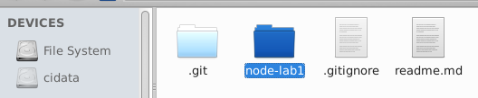
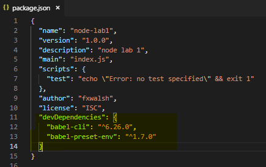

# Development Dependencies
We will now set up and configure a development environment for Node.js. 

## package.json
If you're developing a Node program or library for deployment, it's standard practice to include a **package.json** file. This file is the **manifest of the Node project** and is located at your project root. It contains various information specific to your project such as module dependencies and scripts. 

- Create a new folder called *node_lab1* in your new repo.

- Open a terminal window in *node_lab1* and enter the following command:

~~~bash
npm init
~~~

- You will be prompted for details. Enter the following:

~~~
name: (lab1) node-lab1
version: (1.0.0) 
description: node lab 1
entry point: (index.js)
test command:
git repository: 
keywords:
author: YOUR_GIT_USERNAME
license: (ISC)
~~~

You should now see a ``package.json`` file in the lab directory with these details.

## Babel

We will be writing our Javascript using ES2015 so we require transcoding before our Node app runs. We need to bring in some babel packages to handle this.

- Enter the following command to get the relevant babel package and relevant  presets.

~~~bash
npm install --save-dev babel-cli
npm install --save-dev babel-preset-env
~~~

The ``--save-dev`` will write this dependency to the development section of the package.json. Have a look at the *package.json* file and you will now see the dev dependency on babel as highlighted below:

- To configure babel to transcode from es2015, create a file called **.babelrc** in the **node-lab1** folder and enter in the following:
~~~json
{
  "presets": ["env"]
}
~~~
Now have a look at the  *package.json* file. You'll see that the babel development dependencies are specified.  

## Nodemon
When we change things in a Node.js project, a restart is required for the changes to be reflected in the running process. This can be very time consuming. Instead of manually restarting Node, we will install the ``nodemon`` package as a **development dependency**, which can monitor our files and auto-restart Node for us when we save changes to disk.

- Install Nodemon:
~~~bash
npm install --save-dev nodemon
~~~

## Commit it

Now that we have a our basic setup and configuration complete,this is a good time to commit your changes to git.

- In the directory *ewd-node_labs_2019* run the following:
~~~bash
git add --all
git commit -m "set up and initial configuration"
~~~

You should **NOT** see any output indicating changes ignored file and folders, for example the *node_modules*. We do not need to track changes here as it's contents are specified in the *package.json*.
