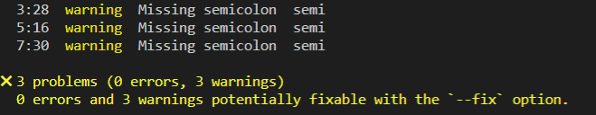
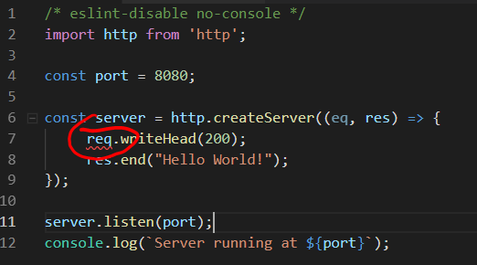

# Linting
It'd be nice to get feedback on the quality of your Javascript code as you write it. ESLint is a tool for identifying and reporting on patterns found in ECMAScript/JavaScript code. It can be used to detect syntax errors in the editor and also to enforce code styles, for example the use of semicolons at the end of each statement.

- Install ESLint as follows:
~~~bash
npm install --save-dev eslint babel-eslint
~~~

- To configure ESLint, enter the following at the command line:
~~~bash
npx eslint --init
~~~

- Answer the resulting questions as follows:

You should now see a file called *.eslintrc.json* in the *node-lab1* folder.

- Open *.eslintrc.json* and replace the ``rules`` property with the following: 

~~~json
"rules": {
        "semi": 1,
        "no-console": "off"
    }
~~~

The *.eslint.json* file specifies that we wish to lint ES6 Javascript in module format (uses imports and exports). We also specify the environment is Node.js with associated global variables and Node.js scoping. Finally, we add some rules that warn if you leave out a semicolon and permit the use of ``console.log()`` (we should really use a proper logging module...).

You've now set your project folder up for linting your Javascript files.

> NOTE: These linting rules are to keep your code style consistent. If you already use JS and you wish to follow other rules (with justification) then feel free to implement them here. For example, a lot of JS developers do not use the semicolon at the end of each statement (as you've seen in index.js, you don't need it!)

### How bad is your code?
Now lets check your code using ESLint on the command line.

- Run the following command to lint your code:
~~~bash
npx eslint index.js
~~~
The rules will warn you if any statement does not end with a semicolon. The linter should highlight this and you should see the following output:

You can fix manually or use the command ``npx eslint index.js --fix`` to resolve the problems(if the linter suggests it).
When the code is in good order, the linter should return nothing. Nice code!

## Linting in VS Code

If you use the VS Code editor you can install the **ESLint Extension** so that the editor will highlight issues as you type. 

Do ``control-shift-x`` search for "ESLint" and install. It will automatically pick up the ESLint config of your folder...

## Commit your changes
- Commit the changes you have just made using git.
~~~bash
git add -A
git commit -m "node-lab1,  simple server"
~~~
