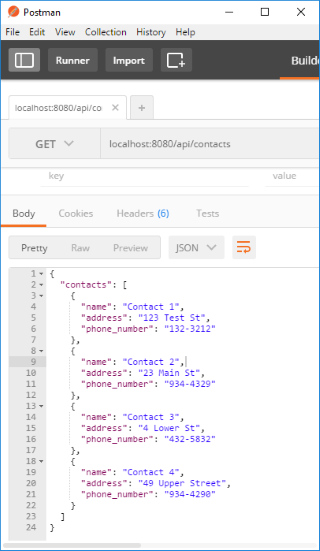
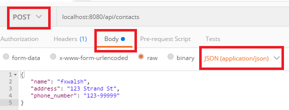
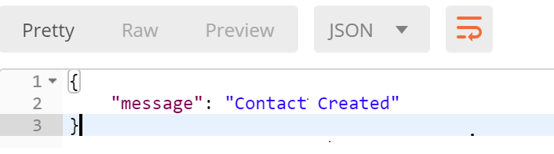
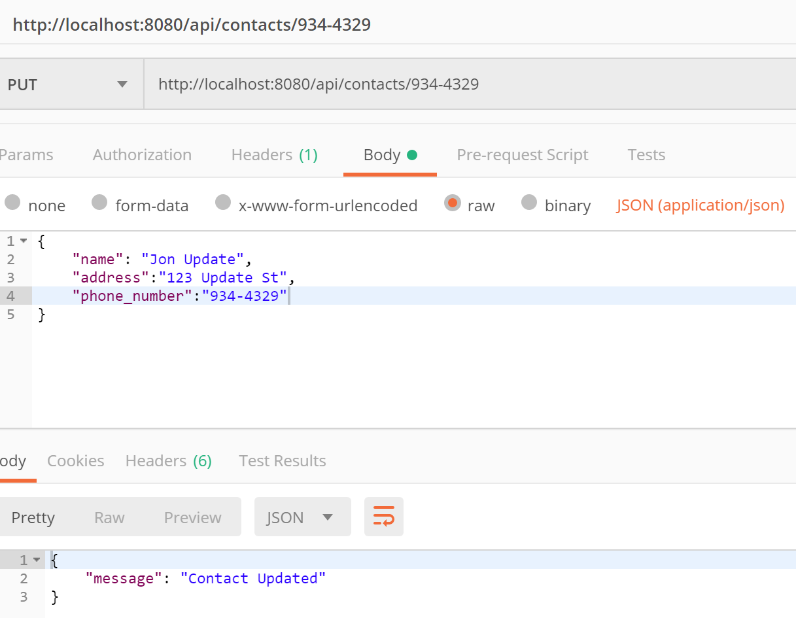

# Contacts API
We will enhance the Contacts API from last weeks lab. The following is a suggested API design for Contacts API.


# API Design
We are going to create an API to manage contact data. The proposed API is as follows:


### Set up

+ User the **node-lab1** folder from last weeks lab as the starting point for this lab. If you do not have a solution for last weeks lab, you can get it from the labs folder in the examples repo at https://github.com/fxwalsh/ewd-examples-2019.git.

+ Install the following packages in your lab folder.

> ```script
npm install --save body-parser
npm install --save lodash
```
Body-parser is a middleware that express can use to parse json.

+ Update index.js to import and use **body-parser** in it's middleware stack.

> ```javascript
import bodyParser from 'body-parser';
....
//configure body-parser
app.use(bodyParser.json());
app.use(bodyParser.urlencoded());
....
```

+ Before we go any further, test the contacts API using your Rest client(e.g. Postman). This should be still working the same from last weeks lab.



## Add a Contact
+ Now replace the contents of the contacts routing script, **/api/contacts/index.js**, with the following code.

```javascript
import express from 'express';
import { contacts } from './contacts';

const router = express.Router();

router.get('/', (req, res) => {
  res.send({ contacts: contacts });
});

router.post('/', (req, res) => {
		let newContact = req.body;
		if (newContact){
          contacts.push({name: newContact.name, address : newContact.address, phone_number: newContact.phone_number }) ;
          res.status(201).send({message: "Contact Created"});
      }else{
      	  res.status(400).send({message: "Unable to find Contact in request. No Contact Found in body"});
      }
});

export default router;
```
The above script adds a HTTP post route that gets a new contact data from the request body (``req.body``) and pushes it onto the contacts list.

- Test with your Rest Client. You will need to supply a JSON representation of the new client in the HTTP request **body** and make sure to select **post** as the HTTP method.



All going well, you should see a successful response similar to the following:



## Update a Contact

+ Updating a contact involves replacing a contact with the new data in the HTTP request body. This corresponds to a HTTP PUT request. For now, use the phone number as the unique key to identify contacts. Add the following routing code to the end of **/api/contacts/index.js**.


```javascript
// Update a contact
router.put('/:id', (req, res) => {
     const key = req.params.id;
     const updateContact = req.body;
     const index = contacts.map((contact)=>{
return contact.phone_number;
}).indexOf(key);
            if (index !== -1) {
               contacts.splice(index, 1, {name: updateContact.name, address: updateContact.address,
               phone_number: updateContact.phone_number});
               res.status(200).send({message: 'Contact Updated'});
              } else {
          res.status(400).send({message: 'Unable to find Contact in request. No Contact Found in body'});
      }
});
```

Test using a Rest client by doing a **HTTP PUT** using
the  URL of an existing contact as follows and include a JSON document in the HTTP body to replace it.

 > http://localhost:8080/api/contacts/934-4329

Using Postman, you should see something similar to the following: 



## Delete a Contact

+ Include the following function and test that the function removes a contact.(e.g. perform a HTTP DELETE on http://localhost:8080/api/contacts/934-4329). You do not need to provide any body data for a delete.

```javascript
// Delete a contact
router.delete('/:id', (req, res) => {
     const key = req.params.id;
     const index = contacts.map((contact)=>{
return contact.phone_number;
}).indexOf(key);
    if (index > -1) {
contacts.splice(index, 1);
        res.status(200).send({message: `Deleted contact with phone_number: ${key}.`});
    } else {
      res.status(400).send({message: `Unable to find contact with phone_number: ${key}.`});
      }
});
```

Check by performing a Delete followed by a Get.

## Commit it

Commit the changes you just made to your repo.

```bash
git add --all
git commit -m "added routing for add,update,delete contact"
```
