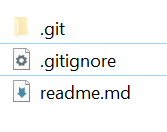

# Hooking up the React App.
We will now connect your Hacker News React App to the API. This step requires completion of the React labs.

## System Architecture

We will keep using the **create-react-app** framework you were using previously. **create-react-app** provides a mechanism for working with an API server in development. We can have the development server proxy requests intended for our API server as follows:


The React app makes an API request to localhost:3000, the Webpack development server. The development server proxies that request to the API server. This will remove any Cross-Origin-Resource-Sharing (CORS) issues with the browser.
For this to work we need to launch both the create-react-app dev server and the API server in order to run the app locally. We also need to get the react dev server to proxy requests to the Express API.

+ Copy the complete hackerNews app from it's current location and put it in the root of your Express API. It should look like this:


+ The proxy functionality requires the version of *react-scripts* to be greater than 0.8.5. Check this is the case by looking at the dependencies list in */hackernews/package.json*.

+ Open a console window in the hackerNews folder and start the react app:
```
npm start
```

Check that the app functions as before. If it's not working then check the error messages if any.

## Set up

#### Nodemon filter
We want the nodemon process to ignore any changes in the *hackerNews* folder as these will not affect the API. In the **package.json file in the node app root folder (/package.json**, update the scripts property to the following:

```json
"scripts": {
    "start": "nodemon --ignore hackerNews/* --exec babel-node index.js"
  }
```

#### Proxy Server
To have the React development server proxy our API requests to our Express API server, we need to add the following to the **package.json file in the hackerNews folder (/hackerNewes/package.json).**

```json
...
"proxy":"http://localhost:8080",
...
```

- **You must restart your React app for the new proxy setting to take affect.** 
The Webpack server should now forward any request for unknown resources coming into the Webpack server though to your Express app listening on port 8080.

#### JSX Linting
Check that your current linter will not recognise JSX syntax. This should be already the case from the previous lab. If not, install the relevant plugin:

- Run ``npm install --save-dev eslint-plugin-react``

- If not already there, add ``"plugins": ["react"]`` to your .eslintrc config file.

In your hackerNews folder, create a new ``.eslintrc.json`` file with the following contents:

~~~json
{
   "env": {
       "browser": true,
       "node": true
   },

   "globals": {
       "React": true
   },

   "ecmaFeatures": {
       "jsx": true
   },

   "plugins": [
       "react"
   ]
}
~~~

#### Axios

We will need to make http requests to the Express API from the React App. In the **hackerNews** folder, install **axois**.

```
npm install --save axios
```

Axios is a promise-based HTTP client for the browser and node.js. You will use it to make requests to the Express API.

### Start both servers
You will need to now start both the react app server and the Express API at the same time. Open two separate command windowsin the hackerNews folder and the parent lab folder. Start the respective servers in both windows:

```
npm start
```

You should see both processes come to life. As before, they support 'hot code changes' so you should not have to restart the processes as you moake changes.

## Integrate the Express Hacker News API

Currently the Hacker News app uses a stubAPI to mimic a real API. We need to replace this.

+ create a new script in the *hackerNews/src* folder called **api.js** and enter the following code:

```javascript
import axios from 'axios';

export const upvote = postId => {
  return axios.post(`/api/posts/${postId}/upvote`)
              .then(resp => resp.data);
};

export const getAll = () => {
   return axios('/api/posts')
              .then(resp => resp.data);
};

export const getPost = postId => {
  return axios.get(`/api/posts/${postId}`)
              .then(resp => resp.data);
};

export const add = (newTitle, newLink) => {
  return axios.post('/api/posts', { title: newTitle, link: newLink })
              .then(resp => resp.data);
};
```

Notice how the routes match what we've implemented in the Express Hacker News API. The proxy property of the package.json provides the host information required to complete the request.

+ In the ``hackerNews/src``, edit ``App.js`` as follows: Replace the  ``import api from './dataStore/stubAPI'`` statement with the following.

```javascript
import * as api from './api';
```

+ We are going to include posts as part of the HackerApp component state. In *App.js*, initialise the ``state`` and add the  ``componentDidMount()`` method to the HackerApp component to initialise the posts from the Express API:

```javascript
export default class App extends Component {

    state = {posts: [{}]};

    componentDidMount() {
        api.getAll().then(resp => {
            this.setState({
                posts: resp.posts
            });
        }).catch(console.error);
    };

    ...
    ...
```

+ Now replace the ``render`` function of the HackerApp component with the following code. This replaces the previous use of stubAPI with the new posts state retrieved from the api package.

```javascript
...
    render() {
        const posts = _.sortBy(this.state.posts, post =>
            post.upvotes);
        return (
            <div className="container">
                <div className="row">
                    <div className="col-md-9 col-md-offset-1">
                        <NewsList posts={posts} 
                        upvoteHandler={this.incrementUpvote} />
                    </div>
                </div>
                <div className="row">
                    <div className="col-md-9 col-md-offset-1">
                        <Form handleAdd={ this.addNewsItem } />
                    </div>
                </div>
            </div>
        );
    }
...
```

Now have a look at the app in the browser. You should see the list of news items as before. This time, however, they are retrieved from the Express API.
Try to add a new post. You'll notice nothing happens. Next we will update the addPost() method.


### Adding a post

+ Locate the ``addNewsItem()`` function in the App component. Replace it with the following:

```javascript
addNewsItem = (title, link) => {
        api.add(title,link)
        .then(resp => {
                      const newPost = {"id":resp.id,"title":title,"link":link,"upvotes":0, "comments":[]};
                      this.setState({posts: this.state.posts.concat([newPost])});
        })
      };
```

This function calls the Express API which returns a promise. When the promise is fulfilled, then it pushes the new post onto the posts state property. The HackerApp should react to this state and call the render function again.

Check the app in the browser again. You should be able add new posts posts to the list.

You can also check, via the API directly, that the new posts are being created.

### Upvoting a Post

The upvote will now cause errors if you try to use it at the moment.
Replace the **incrementUpvote** function in the App compnent with the following:


```javascript
incrementUpvote = (id) => {
  api.upvote(id).then(resp=> {
         var upvotedPost = _.find(this.state.posts, post=>post.id == id);
         upvotedPost.upvotes++;  
         this.setState({})
       }) ;
};
```

## Challenge

Review your progress so far. Use the same approach to accomplish the following:

+ integrate the API with the comment page.
+ Update the contactList app to use the API developed in this lab.
