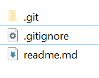

# Lab Repository

As with your React Labs, please create a new empty git repository (with a remote repo also) for your lab work for this section of the module. Initialise the repo in a folder with a meaningful name, such as  ***wad-api-labs-2021**, and a short description.

- create a *.gitignore* file in the repo with the following content
```
node_modules
build
npm-debug.log
.env
.DS_Store
```

- Create a file called *readme.md*  with the following contents:
```
# Web App Dev 2: Web API Labs

Practical labs for the WAD2 module, BSc. Applied/Software Systems Dev/Forensics  

```


Your starting repo for the labs should look like the following.



You should use this repository to contain the rest of your lab work.

>>### Please ensure you maintain a Git repository throughout the development of this app. You should submit all the 'git commit' commands specified in this and subsequent labs. A log of the repository commit history will be used in the assessment of your lab work for this module
