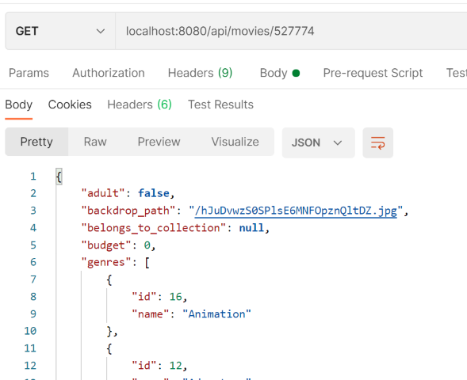

# Get Movies

- Also in the movies folder, create a new file called **index.js** and enter the following javascript:

~~~javascript
import express from 'express';
import { movies, movieReviews, movieDetails } from './moviesData';

const router = express.Router(); 
router.get('/', (req, res) => {
    res.json(movies);
});

export default router;
~~~

- Now update **index.js** in the **root folder** to use the new movies routing script by replacing the contents with the following code

~~~javascript
import dotenv from 'dotenv';
import express from 'express';
import moviesRouter from './api/movies';

dotenv.config();

const app = express();

const port = process.env.PORT;

app.use('/api/movies', moviesRouter);

app.listen(port, () => {
  console.info(`Server running at ${port}`);
});
~~~

- Now test the application again by doing a HTTP GET on ``localhost:8080/api/movies`` using Postman. You should see something simlilar to the following:  

Locate and record the "id" property of one of the movies for the next section.

## Get a Movie By ID

We would like to be able to return the details of a single movie. Using our API design as a reference, we need to update the movies router script to handle a HTT GET request for a specific movie. The handling function will extract the movie ID from the ``req`` and use it to return the specific movie in the ``res``

+ In the router script (**/api/movies/index.js**), add the following code just above the ``export`` statement. 

~~~javascript
// Get movie details
router.get('/:id', (req, res) => {
    const id = parseInt(req.params.id);
    if (movieDetails.id == id) {
        res.status(200).json(movieDetails);
    } else {
        res.status(404).json({
            message: 'The resource you requested could not be found.',
            status_code: 404
        });
    }
});
~~~

Now make a request using the ``id`` you recorded in the last step. You should see the result similar to the following:  

Now try it **with a random id that doesn't exist in the list**. You should see the following result:

## Commit your changes

- Commit the changes you have just made using git.

~~~bash
git add -A
git commit -m "Initial Express App"
~~~
