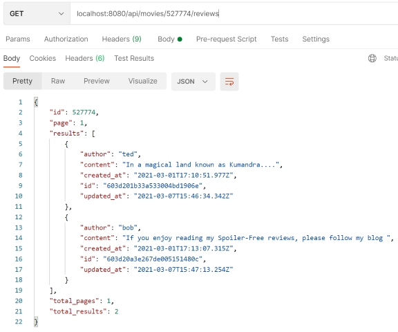
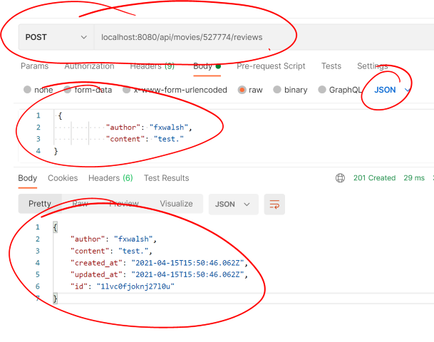

# Get/Post a Movie Review

To implement movie reviews endpoint, we will return the list example review data we used in the last lab(exercises section). As before, it will suffice for now to use a reviews list for just one movie. 

+ In **/api/movies/index.js**, add the following code to process **GET /api/movies/:id/reviews** endpoint:


```javascript
// Get movie reviews
router.get('/:id/reviews', (req, res) => {
    const id = parseInt(req.params.id);
    // find reviews in list
    if (movieReviews.id == id) {
        res.status(200).json(movieReviews);
    } else {
        res.status(404).json({
            message: 'The resource you requested could not be found.',
            status_code: 404
        });
    }
});
```

Test again using a Postman by doing a **HTTP GET** using the  URL.

 > http://localhost:8080/api/movies/527774/reviews

Using Postman, you should see something similar to the following: 



## Add a Movie Review

If you refer to the API definition in the forst page, we specified the *POST /api/movies/:id/reviews* endoint would add a review. The body of the  *POST /api/movies/:id/reviews* will take the following form:

~~~json
{
  "author": "string",
  "content": "string"
}
~~~

You will now add the endpoint to the router that will access the request body and add additional properties required for the review: ``created_at``, ``updated_at``, and ``id``.

+ Add the necessary middleware to parse JSON data in the request body. Open the entry point script, **index.js** in the root folder (**movies-api**), and add the express.json() function to the middleware stack **before the moviesRouter is added** (remember middleware is used in the order it appears) :

  ~~~javascript
  app.use(express.json());
  ~~~

+ Open a command line **in the movies-api** folder and install the following package:

  ~~~bash
  npm install --save uniqid
  ~~~

This module will be used to compute a random ID for a new review. Ultimately, the Mongo DB will do this.

+ Open the movies router, **/api/movies/index.js** and add the following import statement  and new endpoint  to the existing code

```javascript
import uniqid from 'uniqid'

...

//Post a movie review
router.post('/:id/reviews', (req, res) => {
    const id = parseInt(req.params.id);
    
    if (movieReviews.id == id) {
        req.body.created_at = new Date();
        req.body.updated_at = new Date();
        req.body.id = uniqid();
        movieReviews.results.push(req.body); //push the new review onto the list
        res.status(201).json(req.body);
    } else {
        res.status(404).json({
            message: 'The resource you requested could not be found.',
            status_code: 404
        });
    }
});

```

+ Now check it using **Postman**,  or other means, using the following URL and JSON body shown in the image below (localhost:8080/api/movies/527774/reviews). It should return the updated review object as shown.

  

+ Also, if you use a different id in the URL, it will return a 404 status message.

## Commit it

Commit the changes you just made to your repo.

```bash
git add --all
git commit -m "added routing for movies and movie reviews"
```
