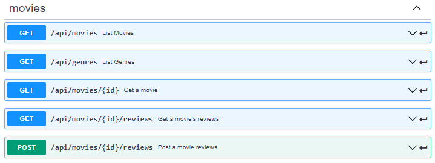

# Exercises

### 1. Genres

Implement the **GET /api/genres** endpoint. 

**Hint:** as before, create a folder for the genres router (**/api/genres**) and use the following temporary data to create a response:

~~~javascript
export const genres= {
    "genres": [
        {
            "id": 28,
            "name": "Action"
        },
        {
            "id": 12,
            "name": "Adventure"
        },
        {
            "id": 16,
            "name": "Animation"
        },
        {
            "id": 35,
            "name": "Comedy"
        },
        {
            "id": 80,
            "name": "Crime"
        },
        {
            "id": 99,
            "name": "Documentary"
        },
        {
            "id": 18,
            "name": "Drama"
        },
        {
            "id": 10751,
            "name": "Family"
        },
        {
            "id": 14,
            "name": "Fantasy"
        },
        {
            "id": 36,
            "name": "History"
        },
        {
            "id": 27,
            "name": "Horror"
        },
        {
            "id": 10402,
            "name": "Music"
        },
        {
            "id": 9648,
            "name": "Mystery"
        },
        {
            "id": 10749,
            "name": "Romance"
        },
        {
            "id": 878,
            "name": "Science Fiction"
        },
        {
            "id": 10770,
            "name": "TV Movie"
        },
        {
            "id": 53,
            "name": "Thriller"
        },
        {
            "id": 10752,
            "name": "War"
        },
        {
            "id": 37,
            "name": "Western"
        }
    ]
};
~~~

If successful, you should be able to do the following using Postman:

