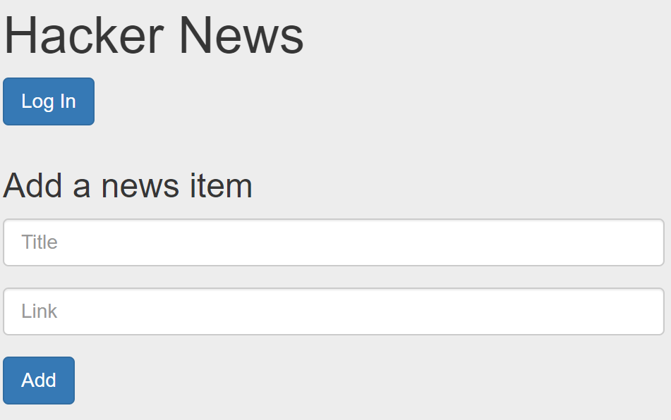
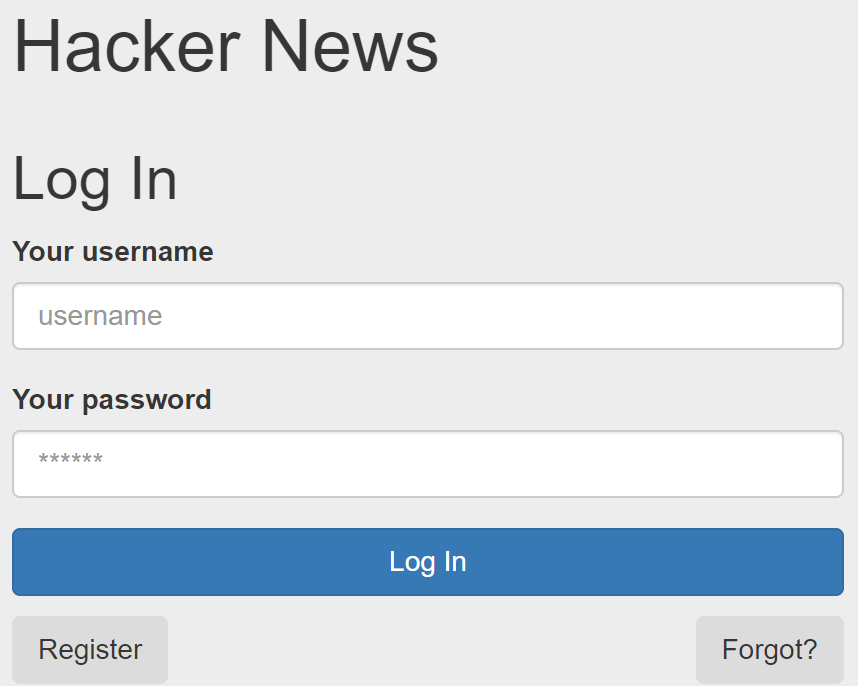

# Create a Login/Signin page

Finally, lets create a basic React component that can manage User registration and Authentication from your Hacker News App.

+ In */hackerNews/src/components*  folder, create a new folder called **loginPage** and add a file **index.js** with the following contents:

~~~Javascript
import React, {Component} from "react";
import * as api from '../../api';
import Auth from '../../auth';
import {Redirect} from 'react-router'

class Login extends Component {
  constructor(props) {
    super(props);
    this.state = {
      username: "",
      password: "",
      confirmpassword: "",
      authenticated: false,
      action: "Log In"
    };
  }

  handleChange = event => {
    this.setState({
      [event.target.id]: event.target.value
    });
  }

  handleSignUp = async (event) => {
    try {
      if (this.state.password !== this.state.comfirmpassword) {
        alert('Passwords Must Match');
        console.log("failed")
      } else {
        const result = await api.signup(this.state.username, this.state.password);
        this.setState({
          authenticated: true
        })
      }

    } catch (e) {
      alert(`Registration Failed ${e}`)
      event.preventDefault();
    }
  };

  submitForm = event => {
    event.preventDefault()
  }

  validateForm = () => {
    return this.state.username.length > 0 && this.state.password.length > 0;
  }

  handleLogin = async (event) => {
    try {
      const result = await api.login(this.state.username, this.state.password);
      Auth.authenticateUser(result.token);
      this.setState({
        authenticated: true
      })
    } catch (e) {
      alert(`Authentication Failed: ${e}`)
      event.preventDefault();
    }
  };

  switchView = event => {
    this.setState({
      action: event.target.value
    })
    event.preventDefault()
  }

  render() {

    const { from } = this.props.location.state || '/';
    const { authenticated } = this.state;

    return (
   

   <h2  className="card-title mb-4 mt-1">{this.state.action}</h2>
	 <form onSubmit={this.submitForm}>
    

    	<label>Your username</label>
        <input id="username" name="" className="form-control" placeholder="username" onChange={this.handleChange} />
    
 
    

    	<label>Your password</label>
      <input id="password" className="form-control" placeholder="******" type="password" onChange={this.handleChange}/>
        {this.state.action==="Register" && 
<label>Confirm password</label><input id="comfirmpassword" className="form-control" placeholder="******" type="password" onChange={this.handleChange}/>
}
    

    

      {this.state.action==="Log In" && <button type="submit"  disabled={!this.validateForm()} className="btn btn-primary btn-block" onClick={this.handleLogin}> Log In  </button>}
      {this.state.action==="Register" && <button type="submit" disabled={!this.validateForm()} className="btn btn-primary btn-block" onClick={this.handleSignUp}> Register  </button>}
      

        {this.state.action==="Log In" && <button   type="submit"  onClick={this.switchView} className="btn btn-secondary" value="Register">Register</button>}
        {this.state.action==="Register" && <button type="submit"   onClick={this.switchView} className="btn btn-secondary" value="Log In">Log In</button>}
      

      

        <button type="button"  className="btn btn-secondary" >Forgot?</button>
      

  

</form>
{authenticated && (<Redirect to={from || '/'}/>)}

    );
  }
}
export default Login;
~~~

Again we import the *api.js* script to interact with the users api. We also use the *auth.js* script to manage local storage of the JWT token.

## Add the loginPage to HackerNews App
We will now update the HackerNews app such that, if the user has not authenticated, we will present a link (in the form of a button) to the login page.

+ Open hackernews/src/index.js and add a new route for the login page.

~~~Javascript
import LoginPage from './components/loginPage';

...

<Switch>
          <Route path='/posts/:post_id' component={ CommentPage } />
          <Route path='/login' component={LoginPage} />
          <Route exact path='/' component={ HackerApp } />
          <Redirect from='*' to='/' />
</Switch>
~~~  

+ Locate the render function in the HackerApp component and replace with the following so that the app redirects to the login page if not authenticated:

~~~Javascript
render() {
        const posts = _.sortBy(this.state.posts, post =>
            post.upvotes);
        return (
            

                

                    

                    {this.state.isHidden &&  <Link to={'/login' }><button type="button" class="btn btn-primary">Log In</button></Link>}
                    {!this.state.isHidden && <NewsList posts={posts} upvoteHandler={this.incrementUpvote} />}
                    

                

                

                    

                        <Form handleAdd={ this.addNewsItem } />
                    

                

            

        );
    }
~~~

> NOTE: Your render function might be different to the above. The main objective is to locate the NewsList component and replace it with the two statements that display/hide the login button and the NewsList component.

+ Now Test the HackerNews app. If not logged in you should see the following:

+ Click on the "login/signin" button. This should display the Login page:

+ Authenticate using username: user1, password: test1. This should return you to the main page and the list of news posts.

 

Congratulations! You've included JWT in your app.

## Challenge

Review your progress so far. Use the same approach to accomplish the following:

+ integrate the API with the comment page.
+ Update the ContactList app to use the API developed in this lab.
