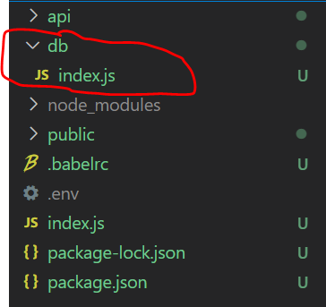
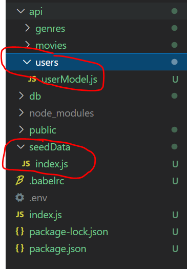

# Mongoose

We will use Mongoose to model our application data. It will allow us, among other things, to  validate and query the data for our applications.

+ Install Mongoose in the **root folder** of your express app(i.e. in the *movies-api* folder) 

```bash
npm install -save mongoose
```

## Connect to MongoDB

You should only need to connect to the Mongo database once, when your Express application starts.

- In the **root folder** of your express app(*movies-api*), open the file */.env* and add the following
```
MONGO_DB=mongodb://localhost:27017/movies_db
```


+ In the **root folder** of your express app, create a new folder called **db** . In db, create a file called **index.js** with the following contents:

```javascript
import dotenv from 'dotenv';
import mongoose from 'mongoose';

dotenv.config();

// Connect to database
mongoose.connect(process.env.MONGO_DB);
const db = mongoose.connection;

db.on('error', (err) => {
    console.log(`database connection error: ${err}`);
});
db.on('disconnected', () => {
    console.log('database disconnected');
});
db.once('open', () => {
    console.log(`database connected to ${db.name} on ${db.host}`);
})
```

Your root folder should now contain a *db* folder with index.js file in it as shown below:



+ We need to import the *db* module into our app. In the **root folder** of your Express app, open the entry point script ``index.js`` . Add the following line to the import statements at the top of the script:

~~~javascript
import './db';
....
~~~

This will automatically trigger the connection to the database when the app starts up. 
When the Express App reloads, you should see output at the command line as following:

```text
Server running at 8080
database connected to movies_db on localhost

```


## Create User Mongoose Schema

With Mongoose we declare the object structure (or schema) for each collection in the database. 

+ In the root folder of your Express app (**movies-api**), create a directory */api/users/* 
+ create the file *userModel.js* containing the following code:

```javascript
import mongoose from 'mongoose';

const Schema = mongoose.Schema;

const UserSchema = new Schema({
  username: { type: String, unique: true, required: true},
  password: {type: String, required: true }
});

export default mongoose.model('User', UserSchema);
```

Schema is a constructor function provided by Mongoose for creating schema instances (in this case, ``UserSchema``). The last line of code above associates the schema instance with a database collection named 'User' (MongoDB creates unknown collections automatically, if necessary). The ``model()`` method returns a model object, which has special methods for querying and manipulating the associated collection, e.g. ``find()``, ``findById()``, ``create()`` etc.

## Load User Data to MongoDB

When the app starts, it would be good to 'seed' the DB with data. This will help with development and testing of functionality as we go forward (it would be switched off for production of course) 
Include a ``SEED_DB`` property in *.env* file to indicate if we wish to seed the database with data. 

```bash
SEED_DB=True
```

+ Create a folder called *seedData* in the root folder of the Express app.

+ In the seedData folder, create a new file called *users.js* with the following content:

  ~~~javascript
  const  users = [
      {
          'username': 'user1',
          'password': 'test1',
      },
      {
          'username': 'user2',
          'password': 'test2',
      },
  ];
  export default users;
  ~~~

  

+ In the *seedData* folder, create a new file called ``index.js``  and enter the following code:

```javascript
import userModel from '../api/users/userModel';
import users from './users';
import dotenv from 'dotenv';

dotenv.config();

// deletes all user documents in collection and inserts test data
async function loadUsers() {
  console.log('load user Data');
  try {
    await userModel.deleteMany();
    await userModel.collection.insertMany(users);
    console.info(`${users.length} users were successfully stored.`);
  } catch (err) {
    console.error(`failed to Load user Data: ${err}`);
  }
}

if (process.env.SEED_DB) {
  loadUsers();
}
```


The root folder of your Express app should now look as follows:


The ``loadUsers()`` function exported from the above script will initialise the database with the users data we used in the previous labs.  
**NOTE:** instead of Promises, a different approach of asynchronous programming is used in the above code: **Async-Await**. For more info see the course notes and have a look at <a href="https://medium.com/better-programming/understanding-async-await-in-javascript-1d81bb079b2c" target="_blank">https://medium.com/better-programming/understanding-async-await-in-javascript-1d81bb079b2c</a>

+ Add the following code to ``index.js`` in the root folder of your Express app.

```javascript
import './seedData'

```

All going well, when the server restarts it should report the successful insertion of User data on the console: 

```text
Server running at 8080
database connected to movies_db on localhost
2 users were successfully stored.
```

## Commit your changes

- Commit the changes you have just made using git.

~~~bash
git add -A
git commit -m "Week 9 Included Mongoose"
~~~
