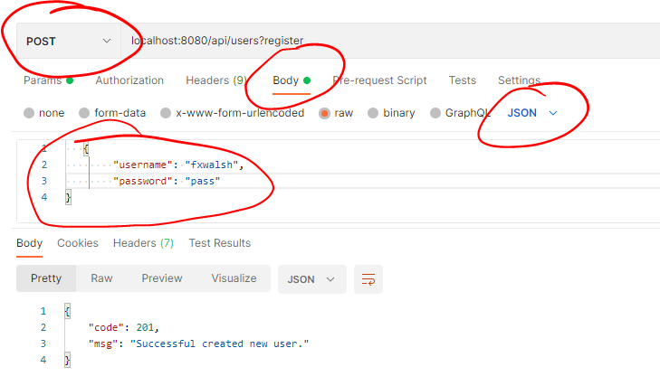
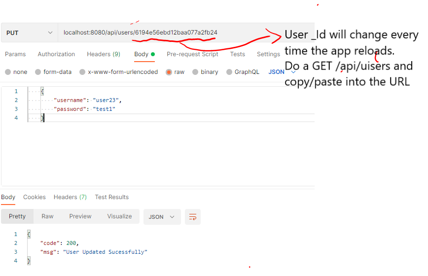

# User Routing

The */api/users* route will be used to authenticate and register users for the API.
Initially, lets just create simple **GET** and **POST** functionality to get all users and add a user.

+ Create the file  ``/api/users/index.js``  with the following code

```javascript
import express from 'express';
import User from './userModel';

const router = express.Router(); // eslint-disable-line

// Get all users
router.get('/', async (req, res) => {
    const users = await User.find();
    res.status(200).json(users);
});

// register(Create)/Authenticate User
router.post('/', async (req, res) => {
    await User(req.body).save();
    res.status(201).json({
        code: 201,
        msg: 'Successful created new user.',
    });
});
export default router;
```

The Mongoose User model is used to create and read documents from the underlying MongoDB database.

- Add the User router to the main app. Open the entry point script,  */index.js*, in the root folder of the app(*movies-ap*i) and import the ``usersRouter``:

~~~javascript
//... other imports
import usersRouter from './api/users';
~~~

Then add the ``usersRouter`` to the middleware stack **before the error handling middleware**:
~~~javascript
//Users router
app.use('/api/users', usersRouter);

~~~

# Test the app

Use Postman to experiment with the API. Check that the following functions work:

 * GET     /api/users              ->  LIST OF USERS
   
 * *POST    /api/users*            ->  Register/Create a USER
   
 * Add a few test users using *POST /api/users* followed by a *GET /api/users* to make sure the data is being stored in the DB.

## Authenticate/Register User

The API is to be used to both register new users and authenticate existing users. To do this, you will modify the *POST /api/users* route to include an *action* parameter in the query string of the URL. 

POST api/users/?**action=register**

The *action* will indicate if the payload is to be used to register or authenticate the User data in the payload. 

+  In */api/users/index.js*, replace the POST '/' route code with the following: 

  ~~~javascript
  // register(Create)/Authenticate User
  router.post('/', async (req, res) => {
          if (req.query.action === 'register') {  //if action is 'register' then save to DB
              await User(req.body).save();
              res.status(201).json({
                  code: 201,
                  msg: 'Successful created new user.',
              });
          }
          else {  //Must be an authenticate then!!! Query the DB and check if there's a match
              const user = await User.findOne(req.body);
              if (!user) {
                  return res.status(401).json({ code: 401, msg: 'Authentication failed' });
              }else{
                  return res.status(200).json({ code: 200, msg: "Authentication Successful", token: 'TEMPORARY_TOKEN' });
              }
          }
  });
  ~~~

 Notice that the value for the action parameter in the query string is accessed from the request using ``req.query.action``. 

## Update a User

The API allows user details to be updated using the *PUT /api/users/:id* endpoint. 

+ Add the following endpoint to the */api/users/index.js* file, before the ``export default router`` statement at the end of the file. 

  ~~~javascript
  // Update a user
  router.put('/:id', async (req, res) => {
      if (req.body._id) delete req.body._id;
      const result = await User.updateOne({
          _id: req.params.id,
      }, req.body);
      if (result.matchedCount) {
          res.status(200).json({ code:200, msg: 'User Updated Sucessfully' });
      } else {
          res.status(404).json({ code: 404, msg: 'Unable to Update User' });
      }
  });
  ~~~
  
  

You will need a valid ID from an existing user document in the Users collection. To get a valid ID for the *PUT /api/users/**:id***, perform a *GET /api/users/* first and copy a user document returned. Then paste it into the body of the PUT request and copy/paste the _id into the URL. 

Change the username to something else before submitting the request.



Now do the Get /api/users again. You should see the updated details in the returned user collection.

## Commit your changes

- Commit the changes you have just made using git.

~~~bash
git add -A
git commit -m "Week 9 Users Router"
~~~
