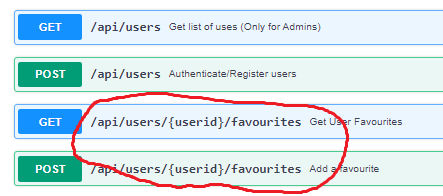

# Enhance User Route

 The User API can be enhanced to support:

 - Favourites: Maintain a list of Movie Favourites

## Favourites

### POST Movie Favourites

- Update */api/users/userModel.js* to include an array of favourites that reference Movies. 

~~~javascript

//... Code as before

const MovieSchema = new Schema({
  id: Number,
  title: String
});

const UserSchema = new Schema({
  username: { type: String, unique: true, required: true},
  password: {type: String, required: true },
  favourites: [MovieSchema]
});

// ..code as before

~~~

- Add the following ***POST /:id/favourites*** route code to */api/users/index.js*:

~~~javascript

/// ... Code as Before
router.post('/:id/favourites', async (req, res) => {
    const newFavourite = req.body;
    if (newFavourite && newFavourite.id) {
        const user = await User.findById(req.params.id);
        if (user) {
            user.favourites.push(newFavourite);
            user.save();
            res.status(201).json({ code: 201, msg: "Added Favourite" });
        } else {
            res.status(404).json({ code: 404, msg: 'Unable to add favourites' });
        }
    }
});
~~~

### Get Movie Favourites

- Now add the HTTP GET for */:id/favourites* route:

~~~javascript
router.get('/:id/favourites', async (req, res) => {
    const user = await User.findById(req.params.id);
    if (user) {
        res.status(200).json(user.favourites);
    } else {
        res.status(404).json({ code: 404, msg: 'Unable to find favourites' });
    }
});
~~~

## Test Movie Favourites

- Now test the  favourites routes using Postman using the screenshots below for guidance. **Remember to get a valid *id* for the URL before doing a POST. You can do this by doing a GET /api/users first and copying a returned *_id* value for one of the users. 

Notice that the only the Favourite Movie ref is stored in the users favourites.

This solution has shortcomings, for example the favourites do not reference the TMDB movies and there is no validation on the favourites schema. We will address these shortcomings in the next lab. 

## Commit your changes

- Commit the changes you have just made using git.

~~~bash
git add -A
git commit -m "Mongo lab User Favourites"
~~~
