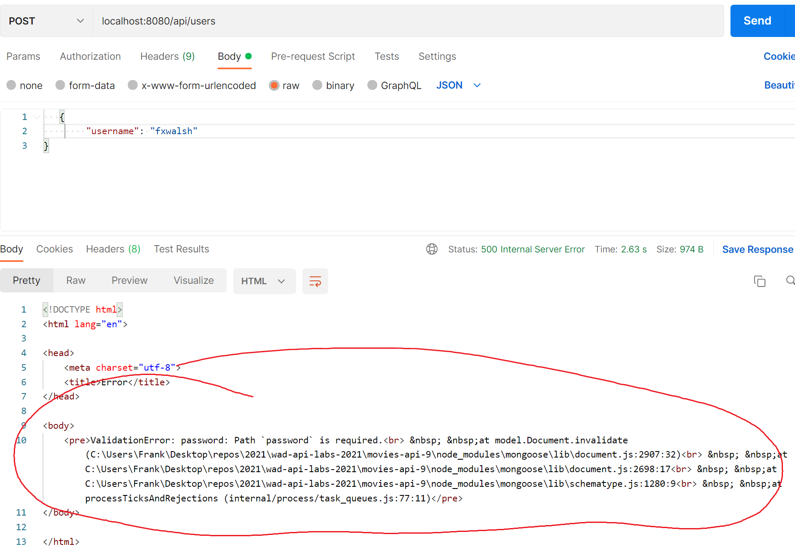

# Error Handling with Promises

-  Try to do a POST api/users/?**action=register** user data that violates the Mongoose schema (e.g. ``{"userName":"frankx"}``). You should get the following:


You'll notice that the request from the Postman client hangs and eventually will timeout. **No HTTP response is returned.** 

If you look at the console running the Express App, you will see the error: 

```text
2 users were successfully stored.
(node:6204) UnhandledPromiseRejectionWarning: ValidationError: password: Path `password` is required.
    at new ValidationError (C:\Users\Frank\Desktop\repos\2020\ewd-examples-2020\node_modules\mongoose\lib\error\validation.js:30:11)
```

Unfortunately with Express, if a Promise is rejected **and not handled**, execution of the "middleware stack" will stop and a response will not be sent. The client will be left hanging. **This will occur even if you have error handler middleware.** 

In this section we will create a generic error handler function that we can use to handle promise rejections.


## Promise Rejection

As you are now using async functions with Mongoose, it is likely they will return rejections (fail) for various reasons such as validation or connection errors.  We can deal with this by surrounding our code with try{} catch(){} but there is another way...

+ Import the following  handler function:

  ~~~bash
  npm install express-async-handler --save
  ~~~

This package provides a way to "wrap" our async functions  so that, if a promise rejection occurs, it will call pass the error on the the next function on the middleware stack. This stops us having to clog up the router with boilerplate error handling code.

+ Update the POST / route by importing the async handler and wrapping the callback function

  

  ~~~javascript
  import asyncHandler from 'express-async-handler';
  
  ....
  
  // register
  router.post('/', asyncHandler(async (req, res) => {
      if (req.query.action === 'register') {  //if action is 'register' then save to DB
          await User(req.body).save()
          res.status(201).json({
              code: 201,
              msg: 'Successful created new user.',
          });
      }
      else {  //Must be authenticating the!!! Query the DB and check if there's a match
          const user = await User.findOne(req.body);
          if (!user) {
              return res.status(401).json({ code: 401, msg: 'Authentication failed' })
          } else {
              return res.status(200).json({ code: 200, msg: "Authentication Successful", token: 'TEMPORARY_TOKEN' })
          }
      }
  }));
  
  ~~~
  
  
  
  There's very little change to the code here - the async function is "wrapped" in the asyncHandler: `` asyncHandler(async(req,res) => {......})  ``
  
  Lets see what happens when we cause a validation error again :

-  Try to POST user data that violates the Mongoose schema by trying to create a user without a password  (e.g. ``{"userName":"frankx"}``). Your HTTP Client (Postman) should now return the following:  



You will notice the error also includes validation error details, line numbers , file locations, and script names. **NOT GOOD: This information could be used to hack the API**.  To fix this, we can include Error handling middleware in our Express app.

- Open */index.js*, the main entry point for the app in the **movies-api** folder, and add the following function **before you assign the ``app`` constant**:  
```javascript
const errHandler = (err, req, res, next) => {
  /* if the error in development then send stack trace to display whole error,
  if it's in production then just send error message  */
  if(process.env.NODE_ENV === 'production') {
    return res.status(500).send(`Something went wrong!`);
  }
  res.status(500).send(`Hey!! You caught the error 👍👍. Here's the details: ${err.stack} `);
};
```

- Then, to handle all errors, add the following line of code **to the bottom of the middleware stack**(i.e. after the last ``app.use(..)`` statement )
```javascript
app.use(errHandler);
```
- Now run the same request again for ``POST localhost:8080/api/users``. This time you should see the following:  
  
You still see the error stack trace however, **if this was in production, you would just see the message "Something went wrong"**. Test this by setting ``NODE_ENV`` to "production" in the *.env* (note: restart the server after changes to the .env file).

## Commit your changes

- Commit the changes you have just made using git.

~~~bash
git add -A
git commit -m "Mongo lab Error Handling"
~~~