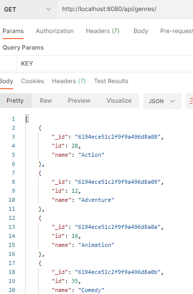

# Exercise: Genres

1. Have a look at the Genres solution from last week. Referencing the previous steps in the lab:

   1. create a Mongoose Schema for Genres in /api/genres:

      ~~~javascript
      import mongoose from 'mongoose';
      
      const Schema = mongoose.Schema;
      
      const GenreSchema = new Schema({
        id: { type: Number,  unique: true, required: true},
        name: {type: String, required: true }
      });
      
      export default mongoose.model('Genre', GenreSchema);
      ~~~

      Use the following data to "Seed" the database(hint: create a *genres.js* file in */seedData* folder and update *index.js* to use it):

      ~~~javascript
      const genres= [
              {
                  "id": 28,
                  "name": "Action"
              },
              {
                  "id": 12,
                  "name": "Adventure"
              },
              {
                  "id": 16,
                  "name": "Animation"
              },
              {
                  "id": 35,
                  "name": "Comedy"
              }
          ]
      ~~~

      Update */api/genres/index.js* to return the Genres list of Genres using the Mongoose model as shown below:

      


## Commit your changes

- Commit the changes you have just made using git.

~~~bash
git add -A
git commit -m "Week 9 Exercises"
~~~

# Appendix
## OPTIONAL STEP: Mongo Cloud

If you want to use Mongo "in the cloud", do the following:

- Go to  <a href="https://cloud.mongodb.com/" target="_blank">https://cloud.mongodb.com/</a>


- Create a free tier cluster in Amazon Ireland Region. **Follow the instructions for a free tier**
- Make sure to follow all the steps to create the cluster. Once complete, get the connection string for your MongoDB as shown below:


- It is risky to have configuration parameters such as user-names, passwords, and instance specific parameters "hard coded" into your javascript programs. In this exercise you will externalise these parameters into the ".env" file. Add the **mongoDb connection string** to the end of your ``.env`` file in the root folder of the express app. 

```bash
mongoDB=mongodb+srv://....
```
