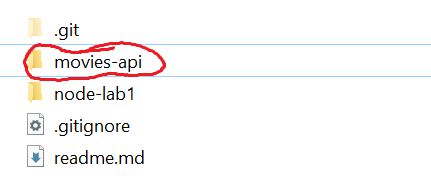

# MongoDB & Mongoose

This lab introduces Mongoose, a simple way of interacting with your Mongo database.

In the last lab, we created a simple API for accessing movie data. We also want to manage user information too, where users can authenticate and register for the API. It also gives us the opportunity to start using Mongoose and Mongo to persist user data.

**You will continue to develop the solution from the last lab, contained in the *movies-api* folder.** 

In this lab you will:
- Install/use a MongoDB

- Use Mongoose to connect and manipulate data in MongoDB

- Create a new Users route 

- Use Promises and handle Promise Rejections

  
