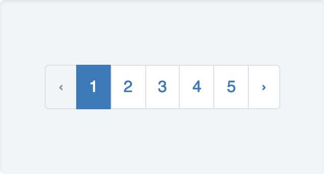
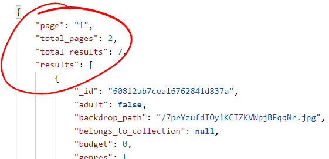
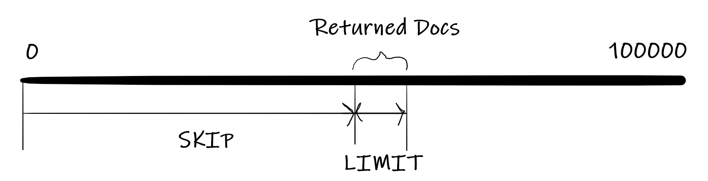
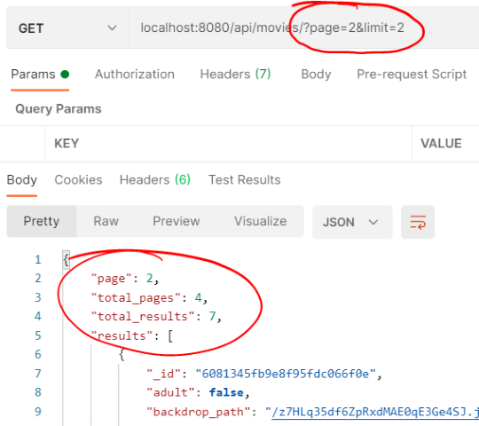

# Pagination

We have put a small set of data in our app for testing. In a production system, there could be very large number of documents (in this case movies) in a response. **Pagination**, also known as paging, allows us to divide the response into discrete pages and limit the number of documents returned in a single request.  You would often see pagination in web apps as page numbers/tabs that allow users to navigate large result sets.

If you examine the structure of the API response from the actual TMDB  web API(https://developers.themoviedb.org/3/discover/movie-discover), it contains  **page, total_pages, total_results,** and **results** fields. The **total_results** is the total number of movies in the DB. The **page** indicates the page number of the results returned.   

The Mongoose Model object allows us to *limit* the number of documents returned from the DB, and also to  *skip* to a particular document in a set of results. You will now update the API to use  **limit** and **page** parameters from the request. The limit parameter will specify the maximum documents returned in each request and page will be used to calculate the number of documents to skip.   

+ Open **/api/movies/index.js**. In the code, locate where you assign the function that handles GET '/' requests (``router.get('/',....``)  and replace with the following:

~~~javascript
router.get('/', asyncHandler(async (req, res) => {
    let { page = 1, limit = 10 } = req.query; // destructure page and limit and set default values
    [page, limit] = [+page, +limit]; //trick to convert to numeric (req.query will contain string values)

    const totalDocumentsPromise = movieModel.estimatedDocumentCount(); //Kick off async calls
    const moviesPromise = movieModel.find().limit(limit).skip((page - 1) * limit);

    const totalDocuments = await totalDocumentsPromise; //wait for the above promises to be fulfilled
    const movies = await moviesPromise;

    const returnObject = { page: page, total_pages: Math.ceil(totalDocuments / limit), total_results: totalDocuments, results: movies };//construct return Object and insert into response object

    res.status(200).json(returnObject);
}));
~~~

Examine the above code and note the comments for each section. The page and limit parameters are extracted from the request and then used to query the database for a particular page in ``movieModel.find().limit(limit).skip((page-1)*limit);``. 

 We use ``movieModel.estimatedDocumentCount();`` to get the total number of documents. 

Finally, when the results are returned, we construct the  ``returnObject`` and put it in the response. 

+ Check it works using default values by entering ``localhost:8080/api/movies/`` . 

+ Try again, this time specifying page and limit values in the URL: ``localhost:8080/api/movies/?page=2&limit=2``:

  

We only have a small set of data but you can limit the results and select a page. Test with different values of page and limit.

