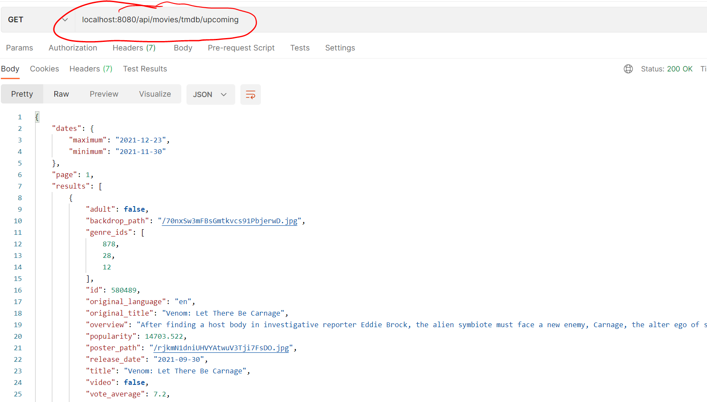

# Upcoming Movies using TMDB

We will continue to develop an API for the MovieDB. However, we will now use data directly from TMDB.  This will help you to drive the React App you completed in previous labs by integrating with the TMDB API.

Open the folder in which you completed last weeks lab (movies-api). **All folder locations in the rest of the lab are relative to here**

**NOTE: Make sure you have done a \*git commit\* before making the following changes**

- Update the `.env` in the route folder and add your authentication key for the Movie DB that you used in the React labs :

```
TMDB_KEY=<YOUR_AUTH_KEY>
```

- Install the *node-fetch* package using NPM:

```
npm install -s node-fetch@2
```

- In the */api* folder, create a file called *tmdb-api.js* with the following contents:

```javascript
import fetch from 'node-fetch';

export const getUpcomingMovies = () => {
    return fetch(
        `https://api.themoviedb.org/3/movie/upcoming?api_key=${process.env.TMDB_KEY}&language=en-US&page=1`
    ).then((response) => {
        if (!response.ok) {
            throw new Error(response.json().message);
        }
        return response.json();
    })
        .catch((error) => {
            throw error
        });
};
```

**This code is copied directly from the API module you used in the React labs.** You will now use it to provide data for your own custom movies API.

- Open */api/movies/index.js* , add the following to the import statements at the top of the file:

```javascript
import {
  getUpcomingMovies
} from '../tmdb-api';

```

+ In the same file, add the following to create an endpoint for */api/movies/upcoming*:

  ~~~javascript
  router.get('/tmdb/upcoming', asyncHandler( async(req, res) => {
      const upcomingMovies = await getUpcomingMovies();
      res.status(200).json(upcomingMovies);
    }));
  ~~~

  

- Now use Postman to check  the route:

