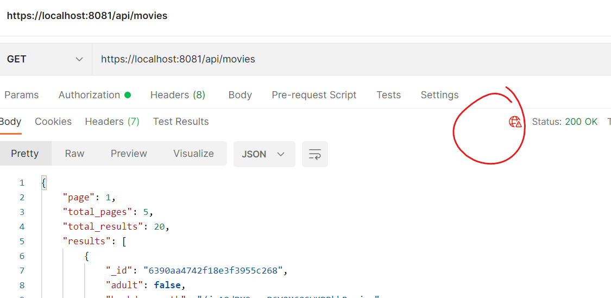

# Express App Configuration

You will now update index.js to use the Express App cert and key to launch an app that supports HTTPS:

+ To make this more realistic, in the keys folder, **delete all files except for expressApp.key and expressApp.crt**

+ Open the root file, index.js, and add the following to the imports at the top of the file:

  ~~~javascript
  import https from 'https'
  import fs from 'fs';
  ~~~

    

+ Define a new options constant that contains an object with key and cert details:

  ~~~javascript
  const options={
    key: fs.readFileSync('./keys/expressApp.key'),
    cert: fs.readFileSync('./keys/expressApp.crt')
    }
  ~~~

   

+ Comment out/remove the statement that binds the Express  App to the port. Using https, wrap the Express app in a TLS server using the options from the last step:

  ~~~javascript
  // COMMENTED 
  //app.listen(port, () => {
  //  console.info(`Server running at ${port}`);
  //});
  
  
  const tlsServer=https.createServer(options,app);
  
  tlsServer.listen(1337,()=>{
    console.log('Secure server is listening on port 1337')
    })
  ~~~

  

+ Now run your Web App as usual and try to access using HTTP. It should fail:
  

  This is because access was via insecure HTTP. 

+ Try the same with HTTPS - you should get a valid response(you may get "unauthorised" if JWT is implemented and you haven't authorised, but that's valid too!)
  

Notice the warning in the response. This is because the client(Postman) is unable to verify the Certificate as we signed it using out "fake" certificate authority. In  a production system, we would have sent our ExpressApp csr to a real CA. 

## Web Pack Server Integration

If you are proxying requests from the React Web Pack server through to your API, you will need to update the proxy property in the package.json file in your React app to specify https.

