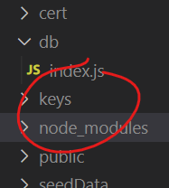
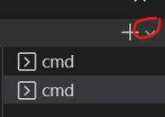
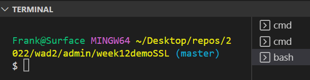
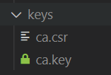

# Your own Certificate Authority

A *Certificate Authority (CA)*  issues  digital certificates. Only certain CAs are widely trusted on the Internet and their certificates are accepted by most browsers. In practice, this is where you would get a certificate for a production server. For the purposes of this lab, however, we will generate our own using OpenSSL. 

### Be the Certificate Authority 

To be a CA, you need a public/private key pair and then issue yourself with a certificate containing this public key. This cert will be **self-signed,** meaning you'll be signing it with your private key.

### OpenSSL

You already have OpenSSL on your machine if you are using Git. (If you are using Linux or MacOS, it will probably be on the path already). On Windows, you can access Open SSL using Git Bash, and should be available through VSCode Terminal.

+ Open the solution to the last lab in VS Code and, in the root folder,  create a folder called keys. 

We will put all the keys/certs in this folder(in the real world, it would just be the webapp certs/keys).

+ In VSCode, select Terminal->New Terminal and select the "down arrow" to reveal terminal options

+ Select Git Bash from the options. This should open the Git Bash window in the root folder of your project. It should look something like this

+ Change directory to the keys folder

  ~~~
  cd keys
  ~~~

+ Using OpenSSL, generate a 4096-bit RSA private key and Certificate Sign Request for the CA

  ~~~
  openssl req -new -newkey rsa:4096 -days 365 -nodes -keyout ca.key -out ca.csr
  ~~~

  

You will be prompted to add identifying information for your website or organisation to the certificate. Since this certificate is being created for a "pretend" CA, make up an identity for your CA. **Don't enter any challenge passwords** .See blow for suggested answers to the questions:

~~~
.....................................++++
writing new private key to 'ca.key'
-----
You are about to be asked to enter information that will be incorporated
into your certificate request.
What you are about to enter is what is called a Distinguished Name or a DN.
There are quite a few fields but you can leave some blank
For some fields there will be a default value,
If you enter '.', the field will be left blank.
-----
Country Name (2 letter code) [AU]:IE
State or Province Name (full name) [Some-State]:Waterford
Locality Name (eg, city) []:Tramore
Organization Name (eg, company) [Internet Widgits Pty Ltd]:Secure Stuff Ltd
Organizational Unit Name (eg, section) []:
Common Name (e.g. server FQDN or YOUR name) []:
Email Address []:

Please enter the following 'extra' attributes
to be sent with your certificate request
A challenge password []:
An optional company name []:
~~~

You should now have a private key  and csr file in the keys folder:

+ Now, as CA, use your private key to issue a (self-)signed certificate based on the CSR generated in the last step:

  ~~~
  openssl x509 -req -trustout -signkey ca.key -in ca.csr -out ca.crt -days 365
  ~~~

  This will generate a certificate for 1 year.

  Now that we're set up as a "fake" Cert Authority, we can now generate signed certs for the Express App.